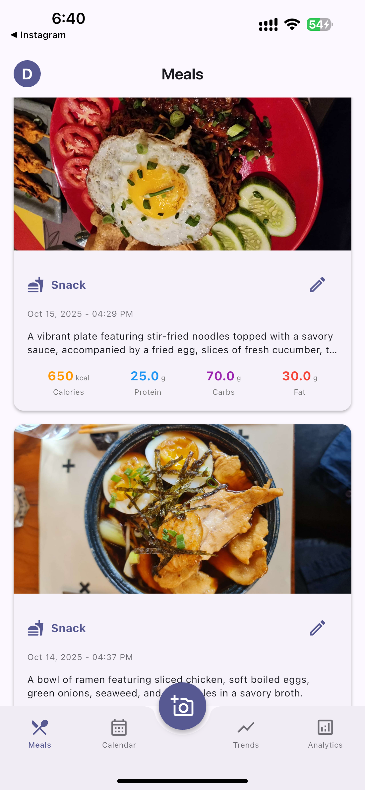
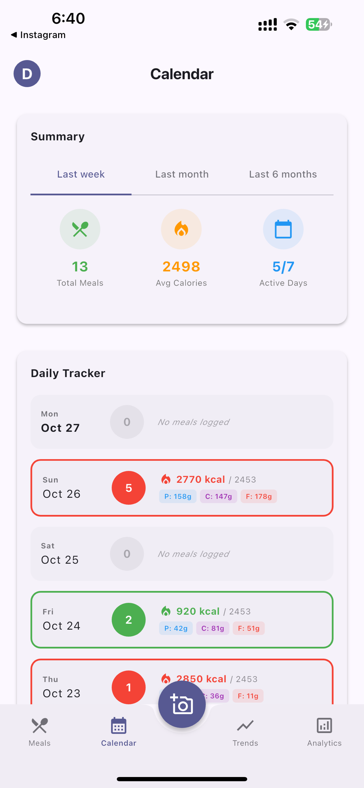
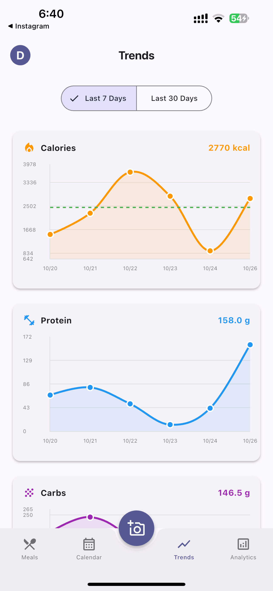
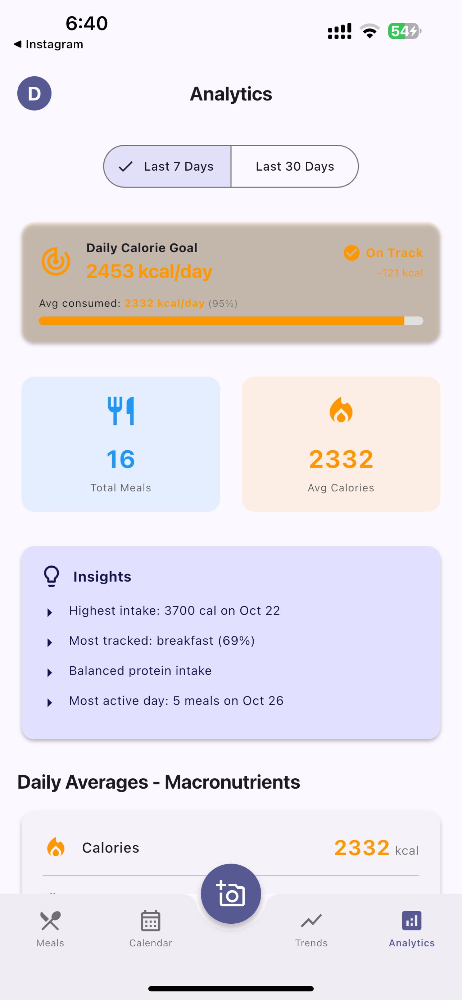
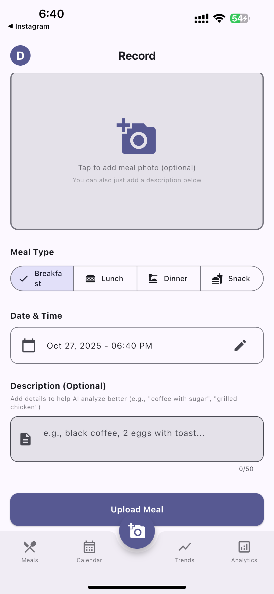
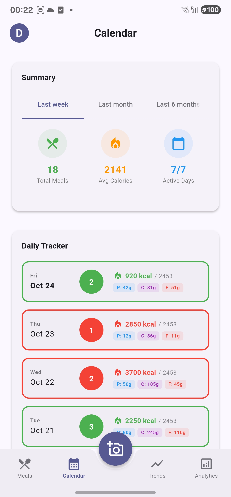
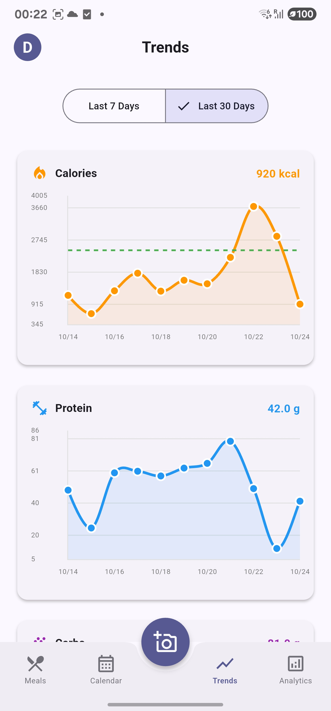
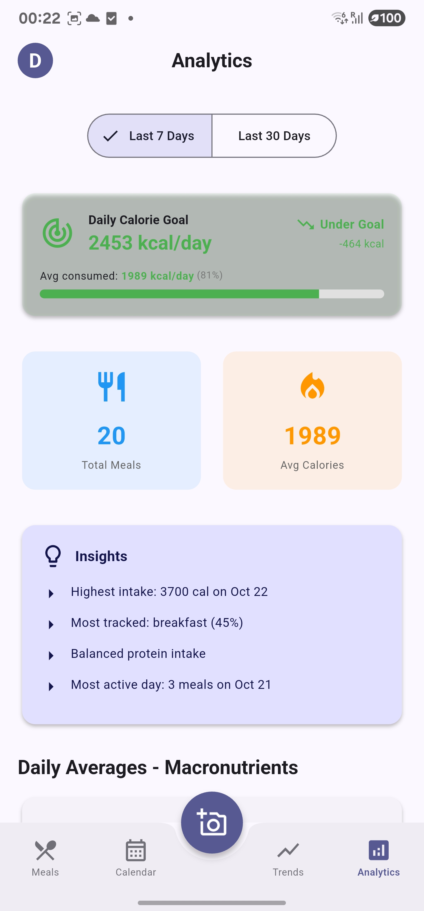

# Nutritheous

Track your meals with AI. Snap a photo or type what you ate, get instant nutrition breakdown.

## What is this?

Nutritheous is a meal tracking app I built to solve a simple problem: counting calories sucks. Instead of manually entering every ingredient, you just take a photo of your meal and GPT-4 Vision figures out the nutrition for you. Works surprisingly well.

The project has two parts:
- **Backend**: Spring Boot REST API (Java 17)
- **Frontend**: Flutter app (iOS, Android, Web)

## Screenshots

### iOS

<table>
  <tr>
    <td></td>
    <td></td>
    <td></td>
  </tr>
  <tr>
    <td align="center">Daily tracking</td>
    <td align="center">Meal details</td>
    <td align="center">Analytics</td>
  </tr>
  <tr>
    <td></td>
    <td></td>
    <td></td>
  </tr>
  <tr>
    <td align="center">Trends</td>
    <td align="center">Profile settings</td>
    <td></td>
  </tr>
</table>

### Android

<table>
  <tr>
    <td></td>
    <td></td>
    <td></td>
  </tr>
  <tr>
    <td align="center">Daily tracking</td>
    <td align="center">Weekly calendar</td>
    <td align="center">Meal upload</td>
  </tr>
  <tr>
    <td></td>
    <td></td>
    <td></td>
  </tr>
  <tr>
    <td align="center">Nutrition trends</td>
    <td align="center">Analytics dashboard</td>
    <td></td>
  </tr>
</table>

## How it works

```
You take a photo → Upload to backend → Stored in GCS → OpenAI analyzes it
                                                                ↓
Frontend displays nutrition ← API returns data ← Saved to PostgreSQL
```

Simple as that. You can also just type a description if you don't have a photo ("black coffee", "2 scrambled eggs"), and it'll estimate the nutrition.

## Quick Start

### What you need

- Java 17+
- Flutter 3.24+
- PostgreSQL 15+
- OpenAI API key
- Google Cloud Storage bucket

### Setup

1. Clone this repo
```bash
git clone https://github.com/yourusername/nutritheous-server.git
cd nutritheous-server
```

2. Create your `.env` file
```bash
cp .env.example .env
```

Edit `.env` with your actual credentials:
```env
DB_HOST=localhost
DB_PORT=5432
DB_NAME=nutritheous
DB_USERNAME=nutritheous
DB_PASSWORD=nutritheous

# GCS credentials as JSON string
GCS_PROJECT_ID=your-project-id
GCS_CREDENTIALS_JSON={"type":"service_account",...}
GCS_BUCKET_NAME=your-bucket-name

# Get from platform.openai.com
OPENAI_API_KEY=sk-proj-...

# Generate with: openssl rand -base64 32
JWT_SECRET=your-secret-key
```

3. Start PostgreSQL
```bash
make docker-up
```

4. Run the backend
```bash
make run
```

5. Run the Flutter app
```bash
cd frontend/nutritheous_app
flutter pub get
flutter run
```

That's it. Backend runs on `localhost:8081`.

## Project Structure

```
nutritheous-server/
├── backend/              # Spring Boot API
│   ├── src/
│   │   └── main/java/com/nutritheous/
│   │       ├── auth/     # Login, registration
│   │       ├── meal/     # Meal CRUD
│   │       ├── storage/  # GCS integration
│   │       └── analyzer/ # OpenAI Vision
│   └── README.md
│
├── frontend/
│   └── nutritheous_app/  # Flutter app
│       ├── lib/
│       │   ├── models/
│       │   ├── services/
│       │   ├── state/    # Riverpod
│       │   └── ui/
│       └── README.md
│
├── Makefile              # Shortcuts for common commands
├── docker-compose.yml
└── .env.example
```

## Tech Stack

**Backend**
- Spring Boot 3.2, Java 17
- PostgreSQL 15 with Flyway migrations
- Google Cloud Storage for images
- OpenAI GPT-4 Vision for analysis
- JWT auth

**Frontend**
- Flutter 3.24, Dart 3.5
- Riverpod for state management
- Dio for HTTP
- Hive for local storage
- Material Design 3

## Makefile Commands

I added a Makefile because typing `./gradlew bootRun` gets old fast.

```bash
make help           # Show all commands
make run            # Start backend
make fresh          # Reset database and start fresh
make build          # Build backend
make test           # Run tests
make db-status      # Check database
make flutter-build  # Build Flutter APK
make flutter-run    # Run Flutter app
```

## API Docs

When the backend is running:
- Swagger UI: http://localhost:8081/swagger-ui.html
- OpenAPI spec: http://localhost:8081/v3/api-docs

## Key Features

**For Users:**
- Photo-based meal tracking
- Text-only entries (no photo needed)
- AI nutrition analysis
- Daily calorie goals based on your profile
- Weekly/monthly analytics
- Nutrition trends over time

**For Developers:**
- Clean separation of backend/frontend
- Environment-based config
- Docker support
- Comprehensive API docs
- Flyway migrations

## Configuration Notes

### GCP Credentials

You have two options:

**Option 1: JSON in .env (recommended)**
```env
GCS_CREDENTIALS_JSON={"type":"service_account","project_id":"..."}
```

**Option 2: File path (local dev)**
```env
GCS_CREDENTIALS_PATH=backend/src/main/resources/gcp-credentials.json
```

The code checks for JSON first, then falls back to file path.

### Flutter .env

The Flutter app needs its own `.env`:
```bash
cd frontend/nutritheous_app
cp .env.example .env
```

Edit with your backend URL:
```env
API_BASE_URL=http://localhost:8081/api
```

For Android emulator, use `http://10.0.2.2:8081/api` instead.

## Database

Uses PostgreSQL 15 with Flyway for migrations. Schema changes go in `backend/src/main/resources/db/migration/`.

To reset the database:
```bash
make fresh
```

## Deployment

The app is currently deployed at https://api.analyze.food

For your own deployment:
1. Make sure all secrets are in environment variables (not hardcoded)
2. Set a strong JWT_SECRET
3. Configure CORS for your frontend domain
4. Use proper SSL/TLS
5. Set up backups for PostgreSQL

## Development

Check the individual READMEs for more details:
- [Backend Documentation](backend/README.md)
- [Frontend Documentation](frontend/nutritheous_app/README.md)

## License

MIT License - do whatever you want with it.
